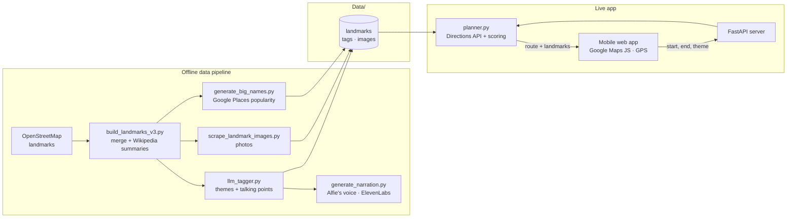

<div align="center">

<picture>
  <source media="(prefers-color-scheme: dark)" srcset="docs/images/logo-dark.png">
  
</picture>

<br>
<br>

**Turn any London journey into a living history lesson.**
<br>
Micro stories and fun facts, triggered in real time, about the exact place outside your window.

<br>

[](https://www.passingby.uk/mobile)


[](#license)

[**Try it live**](https://www.passingby.uk/mobile) · [Watch the demo](https://www.youtube.com/watch?v=hFkSI2gQjCA) · [How it works](#how-it-works) · [Run it locally](#run-it-locally)

<br>


&nbsp;&nbsp;

&nbsp;&nbsp;


</div>

> [!IMPORTANT]
> **Free for non-commercial use. Commercial use requires a licence.**
> You're welcome to use, study and adapt PassingBy for personal, educational and non-profit projects.
> If you'd like to use it commercially, build a product on it, or work together on a similar idea, [get in touch](https://kubajarzebski.xyz/). See [License](#license).

<br>

## v2: revisiting PassingBy

I designed and built the first version of PassingBy in December 2025. Coming back to it less than a year later, I showed the screens to peers, friends and people around me, explored new directions for each step and started rebuilding the interface. That's v2.

Both versions run side by side, so the working version is never lost:

| | Where | Status |
|---|---|---|
| **v1** | [passingby.uk/mobile](https://www.passingby.uk/mobile) · frozen as the [`v1.0` tag](https://github.com/qubula/PassingBy-London/tree/v1.0) | The shipped design. Everything below describes v1. |
| **v2** | `passingby.uk/v2` | In progress. Starts as a copy of v1 and changes screen by screen to the new design. |

The design rounds, feedback and final direction are in [Figma](https://www.figma.com/design/f4HvYvFfbI5Fi7HiI7SMpA/BlackCab-App-Wireframe?node-id=2008-108). Implementation notes live in [`docs/design/`](docs/design/).

## See it in action

<div align="center">
  <a href="https://www.youtube.com/watch?v=hFkSI2gQjCA">
    
  </a>
  <br>
  <sub>A walkthrough of a ride in v1, from planning the route to the landmark cards. Opens on YouTube.</sub>
</div>

## The idea

PassingBy transforms London journeys into living history lessons. Passengers get micro stories and fun facts triggered in real time, each one telling the story of the exact location visible from their window. From iconic sights like Big Ben and the London Eye to hidden gems like Little Dean's Yard that even lifelong Londoners rarely know about, PassingBy is designed for tourists, locals and everyone in between. It turns an ordinary commute into something memorable and makes the city's stories accessible to all.

**How it plays out:** you enter the trip you were already going to make, and PassingBy plans a route that bends a little to take in the city's best sights. As the cab moves, your phone's GPS triggers a card for each landmark you pass, with a short story told by Alfie, a friendly London cabbie. The same route and stories work on foot, so you can also use it as a self-guided walking tour.

<div align="center">
  
  <br>
  <sub>Each landmark arrives as a postcard. Tap it to flip from the photo to the story.</sub>
</div>

## A ride, step by step

<table>
  <tr>
    <td align="center" width="25%"></td>
    <td align="center" width="25%"></td>
    <td align="center" width="25%"></td>
    <td align="center" width="25%"></td>
  </tr>
  <tr>
    <td align="center"><b>1. Where to?</b><br><sub>Your location fills in the start point. Search for a destination.</sub></td>
    <td align="center"><b>2. Choose a route</b><br><sub><i>Fastest</i>, or <i>PassingBy</i> with detours past the sights.</sub></td>
    <td align="center"><b>3. Pick a theme</b><br><sub>Only themes with landmarks on your route are shown.</sub></td>
    <td align="center"><b>4. Ride</b><br><sub>Cards appear as you pass each landmark. Tap to read the story.</sub></td>
  </tr>
</table>

## Narrated by Alfie

Every story is written in the voice of **Alfie**, a warm and slightly cheeky London cabbie. PassingBy is designed so that Alfie tells each story out loud as the cab passes the landmark, so passengers can keep their eyes on the window instead of the screen.

Alfie's voice is a custom voice designed with ElevenLabs Voice Design. He was chosen after testing Google Cloud TTS, OpenAI TTS and ElevenLabs' stock voices, then tuning stability and style until the delivery sounded like a story told from the front seat rather than a script read aloud.

| Listen | Landmark | Length |
|---|---|---|
| ▶ [Play](https://github.com/qubula/PassingBy-London/raw/main/docs/audio/alfie-london-eye.mp3) | London Eye | 0:16 |
| ▶ [Play](https://github.com/qubula/PassingBy-London/raw/main/docs/audio/alfie-buckingham-palace.mp3) | Buckingham Palace | 0:15 |
| ▶ [Play](https://github.com/qubula/PassingBy-London/raw/main/docs/audio/alfie-tower-bridge.mp3) | Tower Bridge | 0:26 |

Narration has been produced for 100 of London's most iconic landmarks so far. Generating audio for all ~1,400 takes time, so the rest are told through the written postcards for now.

**How the audio is made** ([`App/generate_narration.py`](App/generate_narration.py)):

1. **Pick.** The top 100 landmarks are ranked by fame, from Buckingham Palace and Big Ben down.
2. **Pace.** Each story gets natural pauses: ellipses at turns like *"… and"* or *"… but"*, and a paragraph break every two sentences, so Alfie breathes like a real storyteller.
3. **Voice.** The text goes to the ElevenLabs text-to-speech API with Alfie's voice and these settings:

| Setting | Value |
|---|---|
| Voice ID | `LPRLepQnqpzvBlsHyfyS` |
| Model | `eleven_turbo_v2_5` |
| Stability | `0.24`, low, for more variation in timing and tone |
| Similarity boost | `0.79` |
| Style | `0.76`, high, for an expressive, conversational delivery |
| Speaker boost | on |

### Use Alfie in your own project

Alfie is shared in the ElevenLabs Voice Library. Add him to your account from the library, then call the API with his voice ID and the settings above:

```python
import requests

response = requests.post(
    "https://api.elevenlabs.io/v1/text-to-speech/LPRLepQnqpzvBlsHyfyS",
    headers={"xi-api-key": "YOUR_ELEVENLABS_API_KEY"},
    json={
        "text": "Right then, on your left is the London Eye...",
        "model_id": "eleven_turbo_v2_5",
        "voice_settings": {
            "stability": 0.24,
            "similarity_boost": 0.79,
            "style": 0.76,
            "use_speaker_boost": True,
        },
    },
)
open("alfie.mp3", "wb").write(response.content)
```

## Features

- **Two ways to ride.** *Fastest* takes the direct route. *PassingBy* adds short detours through the most iconic landmarks near your path, capped so the trip only takes a few minutes longer.
- **Nine themed tours.** Architecture, Historical, Royal, Museums & Galleries, Parks & Gardens, Religious Heritage, Modern London, Victorian Era, or everything.
- **Location-triggered stories.** Each landmark has its own trigger radius (larger for a palace, smaller for a statue), so its card appears just as it comes into view.
- **~1,400 curated landmarks.** Built from OpenStreetMap and Wikipedia, each with a photo and AI-written talking points for every tour theme.
- **Narrated by Alfie.** A custom ElevenLabs voice tells the stories like a London cabbie, with narration already produced for the 100 most iconic landmarks.
- **Ranked by popularity.** Google Places ratings boost the landmarks people actually care about, so a PassingBy route passes Tower Bridge before an obscure plaque.
- **Ride or walk.** Built for the back seat of a cab, and it works just as well on foot.
- **Nothing to install.** It's a mobile web app: open the link, allow location access, and go.

## Try it

<table>
  <tr>
    <td></td>
    <td>
      Scan with your phone, or open <a href="https://www.passingby.uk/mobile"><b>passingby.uk</b></a>.<br><br>
      Set a start and end point in central London, pick a tour theme, and go.<br>
      <sub>Works best with location access allowed.</sub>
    </td>
  </tr>
</table>

## How it works

The heavy work happens **offline**. A set of build scripts turns raw map data into a curated landmark database with images and pre-written stories. The **live** server only has to plan a route and pick which landmarks to show, so it stays fast and cheap to run: the live site makes no LLM calls.



1. **Plan.** The server asks the Google Directions API for a driving route. In *PassingBy* mode it scores nearby landmarks by theme, popularity and detour cost, then re-routes through the best ones as waypoints.
2. **Match.** It finds every landmark within reach of the final route and attaches the story written for the chosen theme.
3. **Ride.** The browser follows your position with the Geolocation API. When you come within a landmark's trigger radius, its card slides in.

## Tech stack

| Layer | Tools |
|---|---|
| Backend | Python, FastAPI, Uvicorn, Jinja2 |
| Frontend | Vanilla JavaScript, HTML/CSS, Swiper, Satoshi typeface |
| Maps | Google Maps JavaScript API, Places API, Directions API |
| Data pipeline | OpenStreetMap, Wikipedia API, Wikimedia Commons, OpenAI API |
| Voice | ElevenLabs text-to-speech (`eleven_turbo_v2_5`), custom Alfie voice |
| Hosting | Railway, custom domain |

## Project structure

```
├── server.py                  FastAPI app: pages + JSON API
├── App/
│   ├── planner.py             Route planning (fastest / scenic)
│   ├── landmarks.py           Landmark scoring and selection
│   ├── route_landmark_finder.py  Geometry: landmarks near a route
│   ├── tour_types.py          The nine tour themes
│   ├── talking_points.py      Loads the pre-written stories
│   ├── config.py              Tunable limits, weights and colours
│   ├── build_landmarks_v3.py  ┐
│   ├── llm_tagger.py          │ Offline data pipeline
│   ├── scrape_landmark_images.py │
│   ├── generate_big_names.py  │
│   ├── generate_narration.py  ┘ Alfie's narration (ElevenLabs)
│   └── Web_App/               Mobile templates, JS, CSS, fonts, images
├── Data/                      Landmark database, tags, images, categories
├── scripts/                   QR code and exhibition receipt generators
├── tests/                     Routing experiments
└── docs/                      Images (logo, designs, QR codes) and Alfie audio samples
```

## Run it locally

**Requirements:** Python 3.9 or newer, and a Google Cloud project with the Maps JavaScript, Places and Directions APIs enabled.

```bash
git clone https://github.com/qubula/PassingBy-London.git
cd PassingBy-London

python3 -m venv venv
source venv/bin/activate
pip install -r requirements.txt

cp .env.example .env        # then add your own keys
uvicorn server:app --reload
```

Open <http://localhost:8000/mobile>.

To test GPS on a real phone, the page must be served over HTTPS. Create a self-signed certificate once, then run `start_https.sh` to serve the app on your local network:

```bash
openssl req -x509 -newkey rsa:4096 -nodes -days 365 \
  -keyout key.pem -out cert.pem -subj "/CN=localhost"
./start_https.sh
```

### Environment variables

| Variable | Used by | Notes |
|---|---|---|
| `GOOGLE_MAPS_BROWSER_KEY` | Browser | Restrict it to your domain. Maps JavaScript + Places APIs only. |
| `GOOGLE_DIRECTIONS_KEY` | Server | Directions API only. Never sent to the browser. |
| `OPENAI_API_KEY`, `PEXELS_API_KEY`, `UNSPLASH_ACCESS_KEY` | Offline scripts | Only needed to rebuild the data in `Data/`. |
| `ELEVENLABS_API_KEY` | Offline scripts | Only needed to generate Alfie's narration. |

### Deploying

The repo includes a `Procfile` and `railway.json`, so it deploys to [Railway](https://railway.app) as-is. Connect the repository and add the two Google keys as variables.

## License

PassingBy is **source-available** under the [PolyForm Noncommercial License 1.0.0](LICENSE).

| Use | Cost |
|---|---|
| Personal projects, learning, teaching, research, portfolios, non-profit organisations | ✅ **Free** |
| Anything that makes money: paid apps, client work, ad-supported products, use inside a business | 💼 **Commercial licence required** ([contact me](https://kubajarzebski.xyz/)) |

**Commercial licensing and collaboration.** If you want to monetise PassingBy, build something similar, or bring me in to help, I'd be glad to talk. Contact me through my [portfolio](https://kubajarzebski.xyz/) or on [LinkedIn](https://www.linkedin.com/in/jakub-jarzebski).

Third-party data and assets (OpenStreetMap, Wikipedia, Wikimedia Commons photos, Satoshi) keep their own licences; see [LICENSE](LICENSE) for details.

## Credits

- Landmark data © [OpenStreetMap](https://www.openstreetmap.org/copyright) contributors (ODbL)
- Landmark summaries from [Wikipedia](https://www.wikipedia.org/) (CC BY-SA)
- Landmark photos from [Wikimedia Commons](https://commons.wikimedia.org/) (free licences; see each file's page for its author and terms)
- Narration voice: Alfie, designed with [ElevenLabs](https://elevenlabs.io) Voice Design
- Typeface: [Satoshi](https://www.fontshare.com/fonts/satoshi) by Indian Type Foundry

<br>

<div align="center">
Designed and built by <b>Jakub Jarzebski</b>
<br>
<a href="https://kubajarzebski.xyz/">Portfolio</a> · <a href="https://www.linkedin.com/in/jakub-jarzebski">LinkedIn</a> · <a href="https://github.com/qubula">GitHub</a>
</div>
